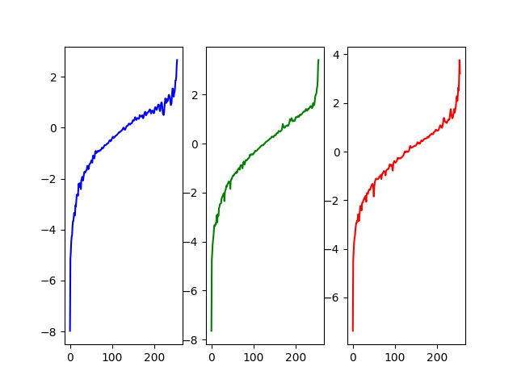
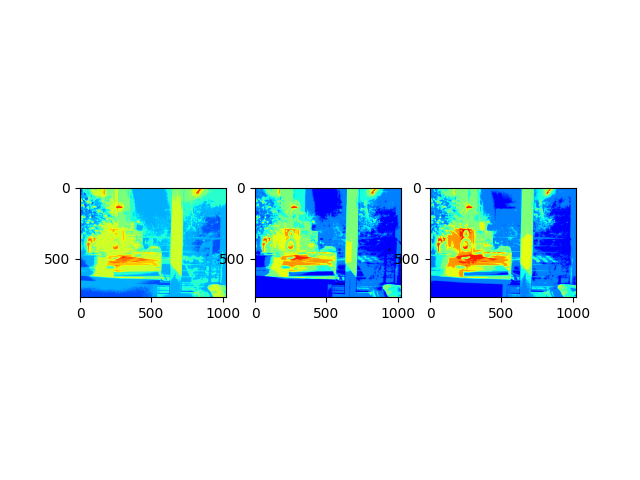
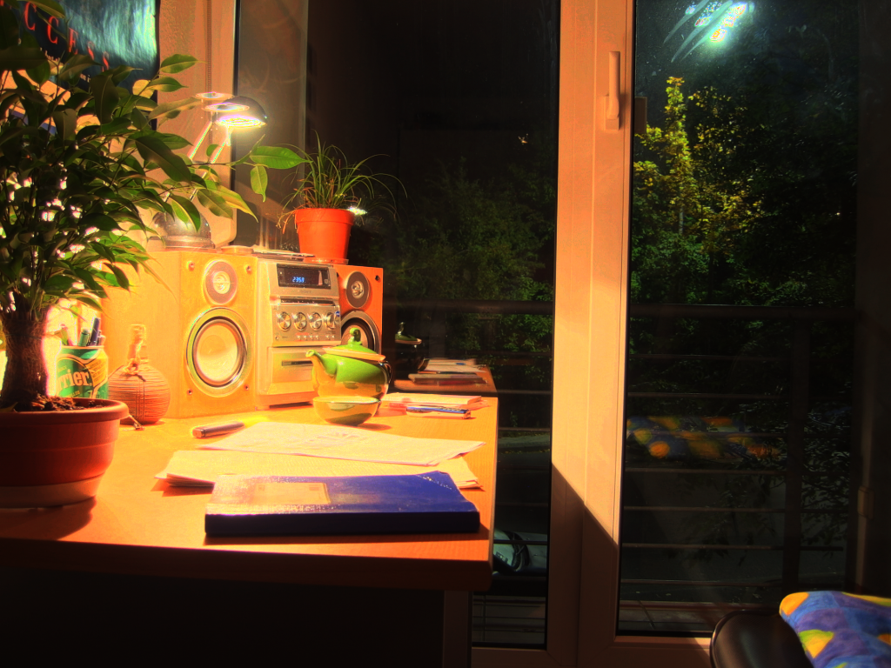
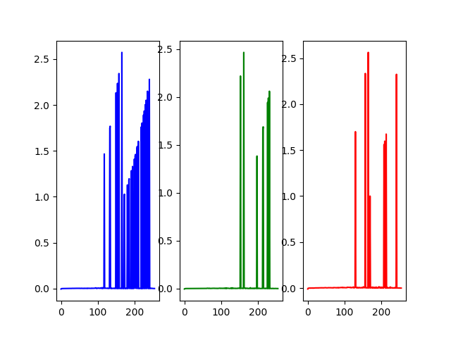
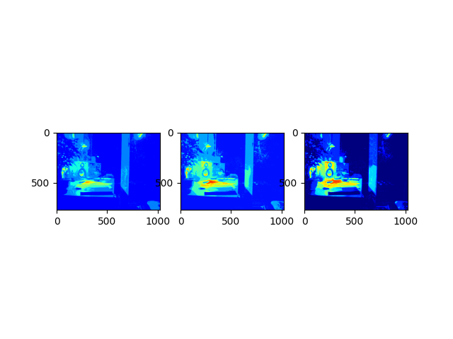
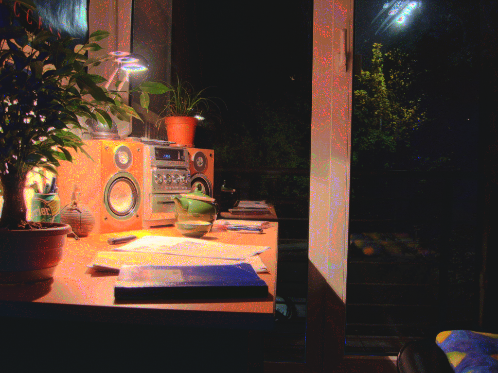

# VFX Project 1 - HDR Imaging
## 0. Team Members
* R11522611 林奕安
* R11522619 莊易璇

## 1. Program Usage
* Run

```
python vfx_hw1.py 
```
* Please check the program document.
```
python vfx_hw1.py --help
```

## 2. Code Works
### 2.1 Image Alignment
* MTB algorithm

### 2.2 HDR Reconstruction
* Debevec's Method
* Robertson's Method

### 2.3 Tone Mapping
* Photographic
    * Global Operator
    * Local  Operator
## 3. Comparison

### 3.1 Debevecs's Method

* Response Curve

* Radiance

* Tonemapping
| Photographic Global Operator | Photographic Local Operator |
| :--------------------------: | :-------------------------: |
|  |  |
### 3.2. Robertson's Method

* Response Curve

* Radiance

* Tonemapping
| Photographic Global Operator | Photographic Local Operator |
| :--------------------------: | :-------------------------: |
|  |  |
## 4. Our HDR Photo

### 4.1. Parameter
* Camera
  * RF35mm
  * ISO800

* Image Alignment
  * depth = 4

* Debevec's Method
  * λ = 1
  
* Photographic Local Operator
  * a = 0.25
  * δ = 10^(-6)

### 4.2. Result

* Response Curve


* Radiance


* Tonemapping 

